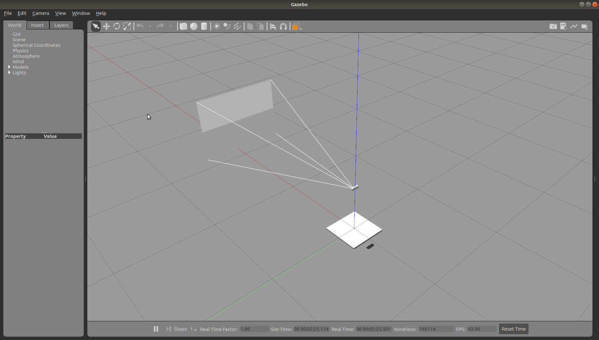
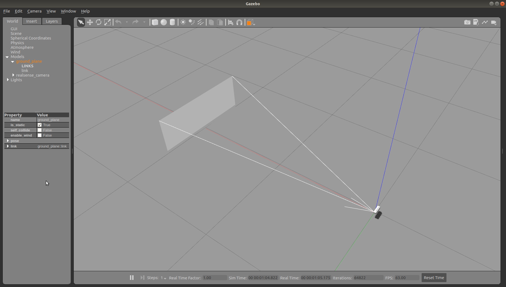
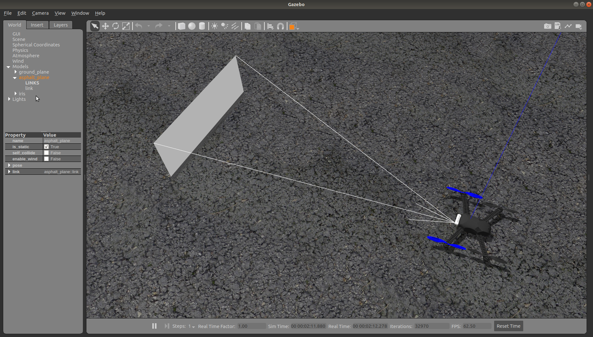
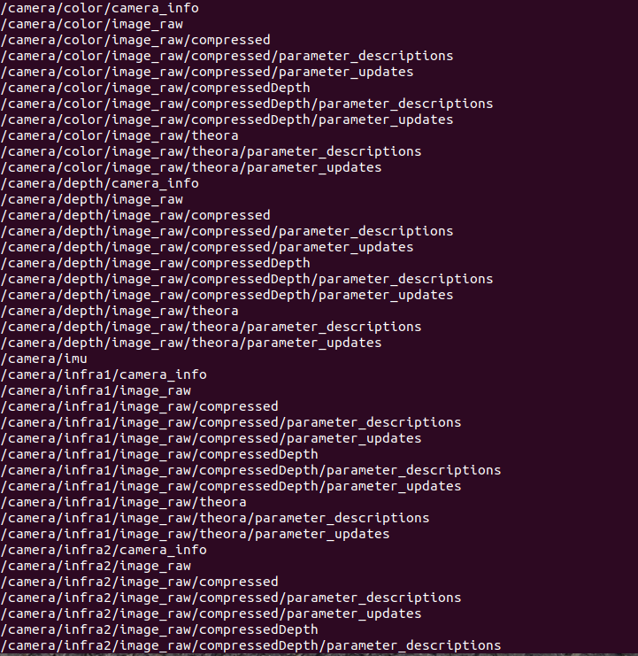
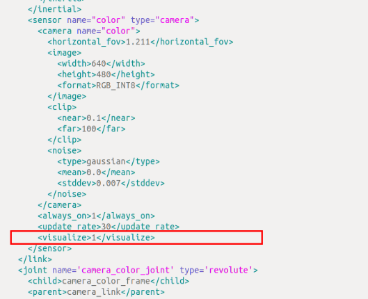
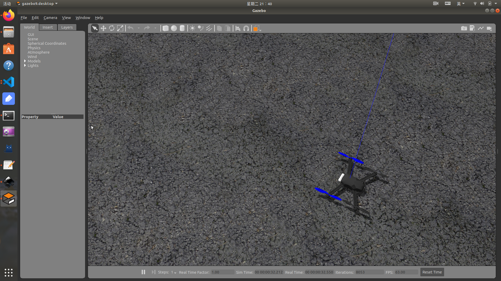

# realsense_ros_gazebo

> 代码克隆于 [Intel RealSense Gazebo/ROS](https://gitee.com/nie_xun/realsense_ros_gazebo?_from=gitee_search)

本仓库提供 d435i 相机模型和 iris_D435i 模型用于在 gazebo 中进行仿真模拟。对原模型配置文件修改了一点参数。

**其实，可以直接使用 px4 官方提供的 iris_depth_camera 模型进行无人机仿真。**


## 快速开始

在已经安装 ros、px4 环境的 ubuntu 18.04 上编译测试通过。

```bash
git clone https://github.com/tugepaopaoo/realsense_ros_gazebo.git
cd realsense_ros_gazebo
catkin_make
```

你可以在编译完成后，在当前终端中通过指令快速查看是否编译成功。
```bash
source devel/setup.bash && roslaunch realsense_ros_gazebo simulation.launch
```

<p align="center">
  
</p>


你也可以输入以下命令,进行查看。

```bash
source devel/setup.bash && roslaunch realsense_ros_gazebo simulation_D435i_sdf.launch
```

<p align="center">
  
</p>

## 环境配置

> 配置环境，可以在gazebo仿真中加载带有 D435i 的 iris 无人机。

1. 复制相机插件 librealsense_gazebo_plugin.so 到 px4 的动态链接库目录中。

```bash
cp ${YOUR_WORKSPACE_PATH}/devel/lib/librealsense_gazebo_plugin.so ${YOUR_PX4_PATH}/build/px4_sitl_default/build_gazebo/
```3

2. 复制相机模型 D435i 和飞机模型 iris_D435i 到 px4 的模型库中。 

```bash
cp -r ${YOUR_WORKSPACE_PATH}/src/realsense_ros_gazebo/sdf/D435i ${YOUR_PX4_PATH}/Tools/sitl_gazebo/models/
cp -r ${YOUR_WORKSPACE_PATH}/src/realsense_ros_gazebo/sdf/iris_D435i ${YOUR_PX4_PATH}/Tools/sitl_gazebo/models/
```

注意：在安装 PX4 时应该已经在 `.bashrc` 文件中配置了相关环境，文件的最后应有如下命令（`/home/user/PX4_Firmware` 替换为你自己的路径，即上文的 `${YOUR_PX4_PATH}`）：

```bash
source /home/user/PX4_Firmware/Tools/setup_gazebo.bash /home/hahaha/PX4_Firmware /home/hahaha/PX4_Firmware/build/px4_sitl_default
export ROS_PACKAGE_PATH=$ROS_PACKAGE_PATH:/home/user/PX4_Firmware
export ROS_PACKAGE_PATH=$ROS_PACKAGE_PATH:/home/user/PX4_Firmware/Tools/sitl_gazebo

```

## 启动 Gazebo 仿真

修改 `${YOUR_PX4_PATH}/launch` 路径下 `mavros_posix_sitl.launch` 文件，将 `<arg name="sdf" default=" "/>` 中的模型替换为我们上面复制到 px4 中的 iris_D435i.sdf 模型，其余保持不变，替换部分修改后如下：

```bash
    <!-- vehicle model and world -->
    <arg name="est" default="ekf2"/>
    <arg name="vehicle" default="iris"/>
    <arg name="world" default="$(find mavlink_sitl_gazebo)/worlds/empty.world"/>
    <arg name="sdf" default="$(find mavlink_sitl_gazebo)/models/iris_D435i/iris_D435i.sdf"/>

```

终端中输入命令，即可在 gazebo 看见 iris_D435i.sdf 模型。

<p align="center">
  
</p>

新开一个终端通过 `rostopic list`，即可查看到相机的相关话题消息。

<p align="center">
  
</p>


## 相机前方的图像界面显示调整

通过对相机模型 `D435i.sdf` 文件中图示属性的调整，可以选择 `显示` 或 `隐藏` 相机前方的实时相机界面。 

- `<visualize>1</visualize>` 时为 `显示`；
- `<visualize>0</visualize>` 时为 `隐藏`；


<p align="center">
  
</p>


隐藏时的效果如下：

<p align="center">
  
</p>


## 对原仓库文件的修改说明

只对原仓库中 `iris_D435i.sdf` 文件进行了修改。

<p align="center">
  
</p>

- 将 `<pose>0.25 0 0 1.5708 0 1.5708</pose>` 修改为`<pose>0.12 0 0 1.5708 0 1.5708</pose>` 

- 将 `<child>D435i::realsense_camera_link</child>` 修改为 `<child>D435i::camera_link</child>`